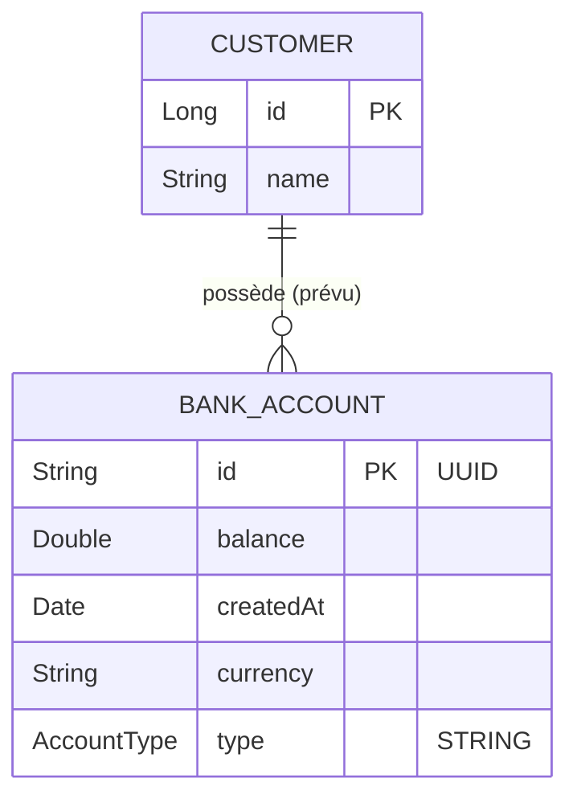

# 🏦 Bank Account Service

Micro-service de **gestion de comptes bancaires** développé avec **Spring Boot**.
Il expose les mêmes opérations CRUD via **trois interfaces** : une API REST personnalisée, une API REST générée automatiquement (Spring Data REST) et une API **GraphQL**.


---

## 📑 Table des matières

1. [Fonctionnalités](#-fonctionnalités)
2. [Stack technique](#-stack-technique)
3. [Architecture](#-architecture)
4. [Structure du projet](#-structure-du-projet)
5. [Modèle de données](#-modèle-de-données)
6. [Prérequis](#-prérequis)
7. [Installation et lancement](#-installation-et-lancement)
8. [Configuration](#-configuration)
9. [Points d'accès (URLs utiles)](#-points-daccès-urls-utiles)
10. [Documentation de l'API REST](#-api-rest-personnalisée--api)
11. [API Spring Data REST](#-api-spring-data-rest-générée-automatiquement)
12. [API GraphQL](#-api-graphql)
13. [Données de démonstration](#-données-de-démonstration)
14. [Console H2](#-console-h2)
15. [Tests](#-tests)
16. [Points d'attention et problèmes connus](#-points-dattention-et-problèmes-connus)
17. [Pistes d'amélioration](#-pistes-damélioration)

---

## ✨ Fonctionnalités

- Créer, consulter, modifier et supprimer des comptes bancaires.
- Deux types de comptes : `CURRENT_ACCOUNT` (compte courant) et `SAVING_ACCOUNT` (compte épargne).
- Recherche de comptes par type (Spring Data REST).
- Trois façons d'interagir avec le service :
  - **REST personnalisé** (`/api/BankAccounts`)
  - **REST généré par Spring Data REST** (`/bankAccounts`)
  - **GraphQL** (`/graphql` + interface GraphiQL)
- Documentation **Swagger / OpenAPI** générée automatiquement.
- Base **H2 en mémoire** avec console web et **10 comptes générés au démarrage**.
- Gestion personnalisée des erreurs GraphQL.

---

## 🧰 Stack technique

| Domaine | Technologie |
|---|---|
| Langage | Java **17** |
| Framework | Spring Boot **4.1.1** |
| Web | Spring Web MVC (`spring-boot-starter-webmvc`) |
| Persistance | Spring Data JPA / Hibernate |
| API REST auto-générée | Spring Data REST |
| API GraphQL | Spring for GraphQL (+ GraphiQL) |
| Documentation API | springdoc-openapi **3.1.1** (Swagger UI) |
| Base de données | H2 (en mémoire) + console H2 |
| Productivité | Lombok |
| Build | Maven (Maven Wrapper `3.9.16` inclus) |
| Tests | JUnit 5, Spring Boot Test, GraphQL Test |

---

## 🏗 Architecture

Le projet suit une architecture en couches classique.

```mermaid
flowchart TD
    Client["Client (navigateur, Postman, curl, GraphiQL)"]

    subgraph Web["Couche Web"]
        REST["AccountRestController<br/>/api/BankAccounts"]
        GQL["BankAccountGraphQlController<br/>/graphql"]
        SDR["Spring Data REST<br/>/bankAccounts, /customers"]
    end

    subgraph Service["Couche Service"]
        SVC["AccountService / AccountServiceImpl"]
        MAP["AccountMapper"]
    end

    subgraph Data["Couche Données"]
        REPO["BankAccountRepository<br/>CustomerRepository"]
        DB[("H2 in-memory<br/>account-db")]
    end

    Client --> REST
    Client --> GQL
    Client --> SDR
    REST --> SVC
    GQL --> SVC
    REST --> REPO
    GQL --> REPO
    SDR --> REPO
    SVC --> MAP
    SVC --> REPO
    REPO --> DB
```



**Principe :** les contrôleurs exposent l'API, le service contient la logique d'ajout et de mise à jour (conversion DTO ⇄ entité via le mapper), et les repositories Spring Data accèdent à la base H2.

---

## 📂 Structure du projet

```
bank-account-service/
├── pom.xml                              # Dépendances et build Maven
├── mvnw / mvnw.cmd                      # Maven Wrapper (Linux/macOS & Windows)
├── HELP.md                              # Aide générée par Spring Initializr
└── src/
    ├── main/
    │   ├── java/org/sid/bank_account_service/
    │   │   ├── BankAccountServiceApplication.java   # Point d'entrée + données de démo
    │   │   ├── Customer.java                        # Entité client
    │   │   ├── DTO/
    │   │   │   ├── BankAccountRequestDTO.java       # Données entrantes (balance, currency, type)
    │   │   │   └── BankAccountResponseDTO.java      # Données sortantes (id, createdAt, ...)
    │   │   ├── entities/
    │   │   │   ├── BankAccount.java                 # Entité compte bancaire
    │   │   │   └── AccountProjection.java           # Projection Spring Data REST
    │   │   ├── enums/
    │   │   │   └── AccountType.java                 # CURRENT_ACCOUNT | SAVING_ACCOUNT
    │   │   ├── exception/
    │   │   │   └── CustomerDataFetcherExceptionResolver.java  # Erreurs GraphQL
    │   │   ├── mappers/
    │   │   │   └── AccountMapper.java               # Entité → DTO de réponse
    │   │   ├── repositories/
    │   │   │   ├── BankAccountRepository.java       # JpaRepository + findByType
    │   │   │   └── CustomerRepository.java
    │   │   ├── service/
    │   │   │   ├── AccountService.java              # Interface
    │   │   │   └── AccountServiceImpl.java          # Implémentation transactionnelle
    │   │   └── web/
    │   │       ├── AccountRestController.java       # API REST /api
    │   │       └── BankAccountGraphQlController.java# API GraphQL
    │   └── resources/
    │       ├── application.properties               # Configuration
    │       └── graphql/schema.graphqls              # Schéma GraphQL
    └── test/java/.../BankAccountServiceApplicationTests.java
```

---

## 🗃 Modèle de données



### `BankAccount`

| Champ | Type | Description |
|---|---|---|
| `id` | `String` | Identifiant unique (UUID généré par le service) |
| `balance` | `Double` | Solde du compte |
| `createdAt` | `Date` | Date de création |
| `currency` | `String` | Devise (ex. `MAD`, `EUR`, `USD`) |
| `type` | `AccountType` | Type de compte, stocké en texte (`EnumType.STRING`) |

### `AccountType` (enum)

- `CURRENT_ACCOUNT` : compte courant
- `SAVING_ACCOUNT` : compte épargne

### `Customer`

| Champ | Type | Description |
|---|---|---|
| `id` | `Long` | Identifiant auto-généré (`IDENTITY`) |
| `name` | `String` | Nom du client |
| `bankAccounts` | `List<BankAccount>` | Relation `@OneToMany(mappedBy = "customer")` |

> ⚠️ La relation `Customer → BankAccount` n'est pas encore complétée côté `BankAccount`. Voir [Points d'attention](#-points-dattention-et-problèmes-connus).

### DTO

- **`BankAccountRequestDTO`** : `balance`, `currency`, `type` (données envoyées par le client).
- **`BankAccountResponseDTO`** : `id`, `balance`, `createdAt`, `currency`, `type` (données renvoyées).

---

## ✅ Prérequis

- **JDK 17** ou supérieur
- **Maven 3.9+** (optionnel : le Maven Wrapper `./mvnw` est fourni)
- Un IDE avec le plugin **Lombok** activé (IntelliJ IDEA recommandé, le dossier `.idea` est présent)
- Accès internet au premier lancement (téléchargement des dépendances)

Vérification :

```bash
java -version
```

---

## 🚀 Installation et lancement

### 1. Récupérer le projet

```bash
git clone <url-du-depot>
cd bank-account-service
```

### 2. Lancer l'application

**Avec le Maven Wrapper (recommandé) :**

```bash
# Linux / macOS
./mvnw spring-boot:run

# Windows
mvnw.cmd spring-boot:run
```

**Avec Maven installé :**

```bash
mvn spring-boot:run
```

### 3. Construire un JAR exécutable

```bash
./mvnw clean package
java -jar target/bank-account-service-0.0.1-SNAPSHOT.jar
```

L'application démarre sur **http://localhost:8081**.

---

## ⚙️ Configuration

Fichier : `src/main/resources/application.properties`

| Propriété | Valeur | Rôle |
|---|---|---|
| `spring.application.name` | `bank-account-service` | Nom de l'application |
| `server.port` | `8081` | Port HTTP |
| `spring.datasource.url` | `jdbc:h2:mem:account-db` | Base H2 en mémoire |
| `spring.datasource.username` | `sa` | Utilisateur de la base |
| `spring.datasource.password` | *(vide)* | Mot de passe de la base |
| `spring.jpa.hibernate.ddl-auto` | `create` | Recrée le schéma à chaque démarrage |
| `spring.h2.console.enabled` | `true` | Active la console H2 |
| `spring.graphql.graphiql.enabled` | `true` | Active l'interface GraphiQL |

> 💡 La base est **en mémoire** : toutes les données sont perdues à l'arrêt de l'application.

---

## 🔗 Points d'accès (URLs utiles)

| Outil | URL |
|---|---|
| API REST personnalisée | http://localhost:8081/api/BankAccounts |
| API Spring Data REST | http://localhost:8081/bankAccounts |
| Swagger UI | http://localhost:8081/swagger-ui/index.html |
| OpenAPI (JSON) | http://localhost:8081/v3/api-docs |
| GraphQL (endpoint) | http://localhost:8081/graphql |
| GraphiQL (interface) | http://localhost:8081/graphiql |
| Console H2 | http://localhost:8081/h2-console |

---

## 🌐 API REST personnalisée : `/api`

Contrôleur : `AccountRestController`

| Méthode | Endpoint | Description |
|---|---|---|
| `GET` | `/api/BankAccounts` | Liste tous les comptes |
| `GET` | `/api/BankAccounts/{id}` | Récupère un compte par son id |
| `POST` | `/api/BankAccounts` | Crée un compte |
| `PUT` | `/api/BankAccounts/{id}` | Met à jour un compte (champs non nuls uniquement) |
| `DELETE` | `/api/BankAccounts/{id}` | Supprime un compte |

### Exemples

**Lister les comptes**

```bash
curl http://localhost:8081/api/BankAccounts
```

**Consulter un compte**

```bash
curl http://localhost:8081/api/BankAccounts/<id>
```

**Modifier un compte** (les paramètres sont envoyés en formulaire, voir [Points d'attention](#-points-dattention-et-problèmes-connus))

```bash
curl -X PUT "http://localhost:8081/api/BankAccounts/<id>" \
     -d "balance=25000" -d "currency=EUR" -d "type=SAVING_ACCOUNT"
```

**Supprimer un compte**

```bash
curl -X DELETE http://localhost:8081/api/BankAccounts/<id>
```

### Exemple de réponse

```json
{
  "id": "3f6c1c1e-9a7b-4a52-8a41-6c3a1b2d9f10",
  "balance": 452310.55,
  "createdAt": "2026-10-04T10:15:32.000+00:00",
  "currency": "MAD",
  "type": "CURRENT_ACCOUNT"
}
```

---

## 🧩 API Spring Data REST (générée automatiquement)

Spring Data REST expose directement les repositories, sans code supplémentaire.

| Méthode | Endpoint | Description |
|---|---|---|
| `GET` | `/bankAccounts` | Liste paginée des comptes (HAL) |
| `GET` | `/bankAccounts/{id}` | Détail d'un compte |
| `POST` | `/bankAccounts` | Création (l'`id` doit être fourni, voir ci-dessous) |
| `PUT` / `PATCH` | `/bankAccounts/{id}` | Mise à jour |
| `DELETE` | `/bankAccounts/{id}` | Suppression |
| `GET` | `/bankAccounts/search/byType?t=SAVING_ACCOUNT` | Recherche par type de compte |
| `GET` | `/customers` | Liste des clients |
| `GET` | `/profile` | Métadonnées ALPS |

**Recherche par type :**

```bash
curl "http://localhost:8081/bankAccounts/search/byType?t=SAVING_ACCOUNT"
```

**Création (JSON) :** l'identifiant n'étant pas auto-généré sur l'entité, il faut le fournir.

```bash
curl -X POST http://localhost:8081/bankAccounts \
     -H "Content-Type: application/json" \
     -d '{"id":"acc-001","balance":5000,"currency":"MAD","type":"CURRENT_ACCOUNT","createdAt":"2026-10-04T10:00:00.000+00:00"}'
```

**Projection :** `AccountProjection` expose uniquement `id`, `type` et `balance`.

```bash
curl "http://localhost:8081/bankAccounts?projection=accountProjection"
```

---

## 🔮 API GraphQL

- **Endpoint :** `POST http://localhost:8081/graphql`
- **Interface interactive :** http://localhost:8081/graphiql
- **Schéma :** `src/main/resources/graphql/schema.graphqls`

### Schéma

```graphql
type Query {
    accountsList: [BankAccount]
    bankAccountById(id: String): BankAccount
}

type Mutation {
    addAccount(bankAccount: BankAccountDTO): BankAccount
    updateAccount(id: String, bankAccount: BankAccountDTO): BankAccount
    deleteAccount(id: String): Boolean
}

type BankAccount {
    id: String
    createdAt: String
    balance: Float
    currency: String
    type: String
}

input BankAccountDTO {
    balance: Float
    currency: String
    type: String
}
```

### Exemples de requêtes

**Lister tous les comptes**

```graphql
query {
  accountsList {
    id
    balance
    currency
    type
    createdAt
  }
}
```

**Récupérer un compte**

```graphql
query {
  bankAccountById(id: "<id>") {
    id
    balance
    type
  }
}
```

**Créer un compte**

```graphql
mutation {
  addAccount(bankAccount: {
    balance: 12000
    currency: "MAD"
    type: "SAVING_ACCOUNT"
  }) {
    id
    balance
    createdAt
    type
  }
}
```

**Modifier un compte**

```graphql
mutation {
  updateAccount(id: "<id>", bankAccount: {
    balance: 30000
    currency: "EUR"
    type: "CURRENT_ACCOUNT"
  }) {
    id
    balance
    currency
    type
  }
}
```

**Supprimer un compte**

```graphql
mutation {
  deleteAccount(id: "<id>")
}
```

### Appel via curl

```bash
curl -X POST http://localhost:8081/graphql \
     -H "Content-Type: application/json" \
     -d '{"query":"{ accountsList { id balance currency type } }"}'
```

### Gestion des erreurs

`CustomerDataFetcherExceptionResolver` transforme toute exception levée dans un *data fetcher* en erreur GraphQL dont le message est celui de l'exception (par exemple `Account <id> not found`).

---

## 🌱 Données de démonstration

Au démarrage, un `CommandLineRunner` (dans `BankAccountServiceApplication`) insère **10 comptes** avec :

- un `id` UUID aléatoire ;
- un type tiré au hasard entre `CURRENT_ACCOUNT` et `SAVING_ACCOUNT` ;
- un solde aléatoire ;
- la date du jour ;
- la devise `MAD`.

Les identifiants étant aléatoires, récupérez-les d'abord avec `GET /api/BankAccounts` ou la requête GraphQL `accountsList`.

---

## 🗄 Console H2

1. Ouvrir http://localhost:8081/h2-console
2. Renseigner :
   - **JDBC URL :** `jdbc:h2:mem:account-db`
   - **User Name :** `sa`
   - **Password :** *(laisser vide)*
3. Cliquer sur **Connect**, puis exécuter par exemple :

```sql
SELECT * FROM BANK_ACCOUNT;
```

---

## 🧪 Tests

Un test de chargement du contexte Spring est fourni (`BankAccountServiceApplicationTests`).

```bash
./mvnw test
```

Les dépendances de test (`spring-boot-starter-data-jpa-test`, `spring-boot-starter-graphql-test`, `spring-boot-starter-webmvc-test`) permettent d'ajouter des tests de repository, de contrôleur REST et de requêtes GraphQL.

---

## ⚠️ Points d'attention et problèmes connus

Ces points ont été relevés à la lecture du code. Ils sont utiles à connaître avant d'aller plus loin.

| # | Zone | Constat | Correction suggérée |
|---|---|---|---|
| 1 | `Customer` ↔ `BankAccount` | `Customer.bankAccounts` utilise `mappedBy = "customer"`, mais `BankAccount` ne possède aucun attribut `customer`. Hibernate refuse normalement ce mapping au démarrage. | Ajouter dans `BankAccount` : `@ManyToOne private Customer customer;` (et `@JsonIgnore` / `@ToString.Exclude` côté `Customer` pour éviter les boucles). |
| 2 | `AccountRestController` (constructeur) | Seul `BankAccountRepository` est injecté. `accountService` et `accountMapper` sont affectés à eux-mêmes (donc `null`). | Injecter les trois dépendances dans le constructeur. |
| 3 | `POST /api/BankAccounts` | Conséquence du point 2 : `accountService` est `null`, la création lève une `NullPointerException`. | Corriger le constructeur (point 2). |
| 4 | `POST` / `PUT` REST | Absence de `@RequestBody` : les données sont lues comme paramètres de formulaire / query, pas comme JSON. | Ajouter `@RequestBody` sur les paramètres. |
| 5 | `PUT /api/BankAccounts/{id}` | `createdAt` est écrasé par la date du jour dès qu'une valeur est envoyée. | Ne pas modifier `createdAt` lors d'une mise à jour. |
| 6 | `AccountServiceImpl.updateAccount` | Reconstruit un nouveau compte avec `createdAt = new Date()` puis `save` : la date de création est perdue, et un `id` inexistant crée un nouveau compte au lieu de lever une erreur. | Charger l'entité existante, modifier les champs, puis sauvegarder. |
| 7 | Gestion des erreurs REST | `RuntimeException` générique et message sans l'id (`String.format("Account is not found", id)`) → réponse HTTP 500. | Créer une exception métier mappée sur HTTP 404 (`@ResponseStatus` ou `@ControllerAdvice`). |
| 8 | Données de démo | `10000 * Math.random() * 90000` produit des soldes pouvant atteindre ~900 millions. | Utiliser par exemple `10000 + Math.random() * 90000`. |
| 9 | `AccountProjection` | La méthode `getbalance()` ne respecte pas la convention JavaBean et retourne un `double` primitif. | Renommer en `Double getBalance()`. |
| 10 | `deleteAccount` (GraphQL) | Retourne toujours `true`, même si le compte n'existe pas. | Vérifier l'existence avant suppression. |
| 11 | Types monétaires | `Double` pour les soldes expose à des erreurs d'arrondi. | Utiliser `BigDecimal`. |
| 12 | Packaging | `Customer` est à la racine du package, hors de `entities/`. | Le déplacer dans `entities/`. |
| 13 | `pom.xml` | Balises `<name/>`, `<description/>`, `<licenses>`, `<developers>` vides. | Les renseigner ou les supprimer. |
| 14 | Double exposition REST | Spring Data REST (`/bankAccounts`) expose le repository en parallèle du contrôleur `/api/BankAccounts`. | Choisir une seule approche, ou configurer `spring.data.rest.base-path=/data`. |

> Remarque : l'environnement d'analyse n'avait pas accès au dépôt Maven, le projet n'a donc pas pu être compilé ni exécuté ici. Les points ci-dessus proviennent de la lecture statique du code.

---

## 🛣 Pistes d'amélioration

- **Fonctionnel**
  - Compléter la gestion des clients (`Customer`) et leur lien avec les comptes.
  - Ajouter des opérations bancaires : dépôt, retrait, virement.
  - Historiser les transactions.
- **Qualité**
  - Validation des entrées (`spring-boot-starter-validation` : `@NotNull`, `@PositiveOrZero`…).
  - Gestionnaire d'exceptions global (`@RestControllerAdvice`).
  - Tests unitaires du service et tests d'intégration REST / GraphQL.
  - Remplacer `Date` par `java.time.Instant` ou `LocalDateTime`.
- **Technique**
  - Base persistante (PostgreSQL / MySQL) avec profils `dev` / `prod`.
  - Migrations avec Flyway ou Liquibase au lieu de `ddl-auto=create`.
  - Sécurité avec Spring Security (JWT / OAuth2).
  - Conteneurisation (Dockerfile, `docker-compose`) et intégration continue.
  - Intégration dans une architecture micro-services (Eureka, Gateway, Config Server).

---

## 👤 Auteur

Projet réalisé dans le cadre de l'apprentissage de Spring Boot (package `org.sid`).

## 📄 Licence

À définir.
